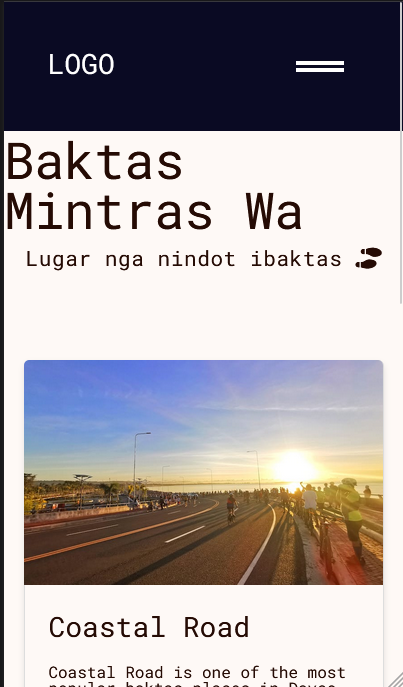
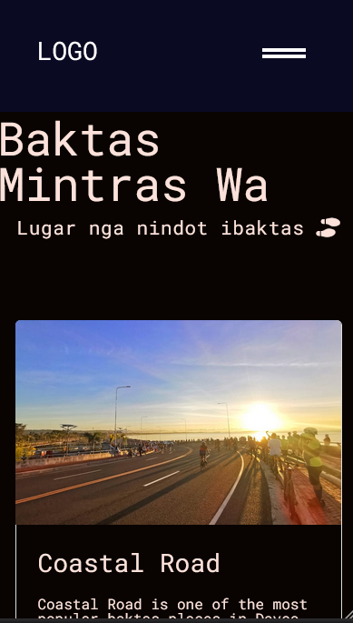

# BMW -Baktas-Mintras-Wa

# Light Mode

## Dark Mode :darkmode:

## Simple personal projects that shares awesome view places here in Dakbayan Davao, Philippines that you can soroy-soroy(Stroll)

### TODO

- [ ] adding features like blog that talks more details about the location, history and tips so you can make the best out of it

### Why I made this project?

This project is project-based learning. It intends to improve my frontend knowledge and I hope I keep improving.\
Any feedback you can DM me. Link in my profile

### Journey

I learned a lot and it is very time consuming, however, it is rewarding

### Resources

Here are useful resources that help me get out of my comfort zone and escaping tutorial hell[^1]\
Helpful tools:\
Generate color palette[^2]\
Font Pairing[^3]

References and tools:
[^1]: <https://www.freecodecamp.org/news/project-based-learning/>
[^2]: <https://www.realtimecolors.com/?colors=0f0f0f-ffffff-155831-d7e4dc-c20002&fonts=Poppins-Poppins>
[^3]: <https://www.fontpair.co/all>

and lots of google :D
